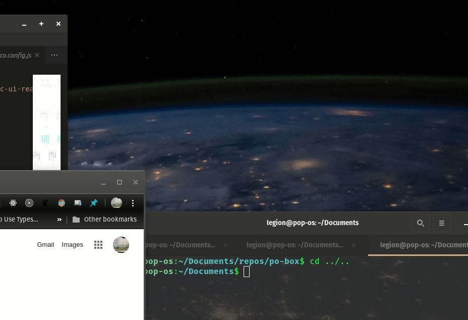

# PObox

Program to help organize a projects resources.

## Features

Saving coding projects

Linking Files, todos, applications, bookmarks, code snippets with syntax highlighting and specific commands to projects for easy access.

Global search of all resources accross all saved projects

One button click launch of all files bookmarks and applications set to auto launch for quickly getting back to work on a project.

Work in progress:
To build run

npm install
npm run build

will compile sqlite for platform and create an executable to launch

after it has been built you can run in development mode using

npm start

# 

